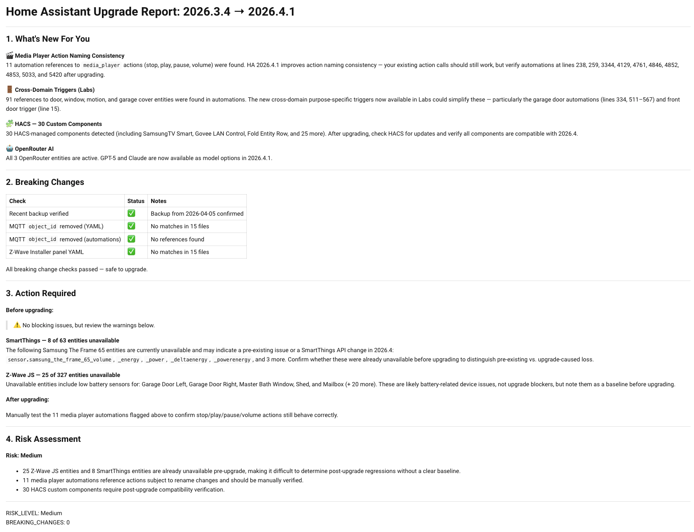

# Upgrade Advisor

[](https://github.com/brianegge/ha-upgrade-advisor/actions/workflows/validate.yml)
[](https://github.com/brianegge/ha-upgrade-advisor/actions/workflows/tests.yml)

AI-powered upgrade analysis for Home Assistant. When an update is available, the integration fetches the release notes, asks your AI agent to identify what could break, then **automatically verifies each potential issue** against your actual configuration — searching your YAML files, checking entity availability, and auditing automations. The result is a report that tells you what IS affected, not what MIGHT be.



## Features

- **Two-phase analysis** — AI identifies potential issues, then the integration verifies them automatically
- Searches your YAML config and Lovelace dashboards for deprecated options
- Checks entity availability and automation references
- Analyzes HA core and HACS component updates
- Uses any HA conversation agent (OpenAI, Google, Anthropic, Ollama, etc. via OpenRouter)
- Creates repair issues for verified breaking changes
- Risk assessment (Low/Medium/High) based on evidence, not speculation

## Requirements

- Home Assistant 2024.7.0 or newer
- A configured AI conversation agent (e.g., via OpenRouter, OpenAI, Google Generative AI)

## Installation

### HACS

1. Open HACS in your Home Assistant instance
2. Click the three dots menu and select "Custom repositories"
3. Add `https://github.com/brianegge/ha-upgrade-advisor` as an Integration
4. Click "Download" on the Upgrade Advisor card
5. Restart Home Assistant

### Manual

1. Copy `custom_components/upgrade_advisor/` to your `config/custom_components/` directory
2. Restart Home Assistant

## Setup

### 1. Add the Integration

1. Go to **Settings > Devices & Services > Add Integration**
2. Search for "Upgrade Advisor"
3. Select your AI conversation agent from the dropdown

### 2. Create the Dashboard

Create a dashboard to view the full upgrade report:

1. Go to **Settings > Dashboards > Add Dashboard**
2. Set the title to **Upgrade Advisor**
3. Set the URL to `upgrade-advisor`
4. Enable **Show in sidebar** (optional)
5. Open the new dashboard and add a **Markdown** card:

```yaml
type: markdown
content: >-
  {{ state_attr('sensor.upgrade_advisor', 'report') }}
```

Notifications will automatically link to this dashboard. The default path is `upgrade-advisor` and can be changed in the integration options.

### 3. Configure Options (Optional)

Go to **Settings > Integrations > Upgrade Advisor > Configure**:

| Option | Default | Description |
|--------|---------|-------------|
| Analyze on update available | On | Auto-analyze when updates appear |
| Analyze HACS updates | On | Include HACS component updates |
| Create repair issues | On | Create repairs for breaking changes |
| Include automations | On | Send automation list to AI for context |
| Include add-ons | On | Send add-on list to AI for context |
| Dashboard URL path | `upgrade-advisor` | Path to the report dashboard |

## How It Works

### Phase 1: AI Plans Checks
When an update is available, the integration fetches release notes from GitHub (including the full blog post for major releases) and sends them to your AI agent along with your installation context. The AI outputs a structured list of automated checks to perform.

### Phase 2: Integration Verifies
The integration executes each check against your actual HA instance:

| Check | What it does |
|-------|-------------|
| `grep_config` | Searches YAML and Lovelace JSON for deprecated config keys |
| `entity_available` | Verifies entities for an integration are not unavailable |
| `automation_references` | Finds automations using deprecated services or entities |
| `integration_installed` | Confirms whether an affected integration is present |
| `backup_recent` | Verifies a recent backup exists before upgrading |
| `unavailable_entities` | Baselines currently broken entities (pre-existing issues) |

### Phase 3: AI Summarizes
The check results (with evidence) are sent back to the AI to produce a concise, factual report:

```
## Breaking Changes Verified

| Check                       | Status         | Evidence                              |
|-----------------------------|----------------|---------------------------------------|
| MQTT object_id removal      | Not affected   | Searched 10 YAML files, no matches    |
| Z-Wave Installer panel      | Not affected   | No installer panel config found       |

## Action Required
No action required — safe to upgrade.
```

## Entities

| Entity | Type | Description |
|--------|------|-------------|
| `sensor.upgrade_advisor` | Sensor | Status: `idle` / `analyzing` / `report_ready` / `error` |
| `sensor.upgrade_advisor_2` | Sensor | Risk level: `unknown` / `low` / `medium` / `high` |
| `event.upgrade_advisor` | Event | Fires when a new report is generated |

### Status Sensor Attributes

- `current_version` — installed version
- `available_version` — target version
- `last_analysis` — timestamp of last report
- `breaking_change_count` — number of verified breaking changes
- `report` — full report (markdown), including all analyzed components

## Services

| Service | Description |
|---------|-------------|
| `upgrade_advisor.analyze` | Analyze all pending updates (HA core + HACS) |
| `upgrade_advisor.analyze_version` | Analyze a specific HA version |

## Automation Example

```yaml
automation:
  - alias: "Notify on upgrade report"
    trigger:
      - platform: state
        entity_id: sensor.upgrade_advisor
        to: "report_ready"
    action:
      - service: notify.mobile_app
        data:
          title: "Upgrade Advisor Report"
          message: >-
            Risk: {{ states('sensor.upgrade_advisor_2') }}
            Breaking changes: {{ state_attr('sensor.upgrade_advisor', 'breaking_change_count') }}
            /upgrade-advisor
```

## Known Limitations

- Advisory only — does not perform upgrades
- Analysis quality depends on the AI conversation agent used
- GitHub API rate limit: 60 requests/hour unauthenticated (sufficient for normal use)
- Two LLM calls per HA core analysis (plan + summarize) — may take 1-2 minutes
- HACS component detection relies on `release_url` attribute containing a GitHub URL
