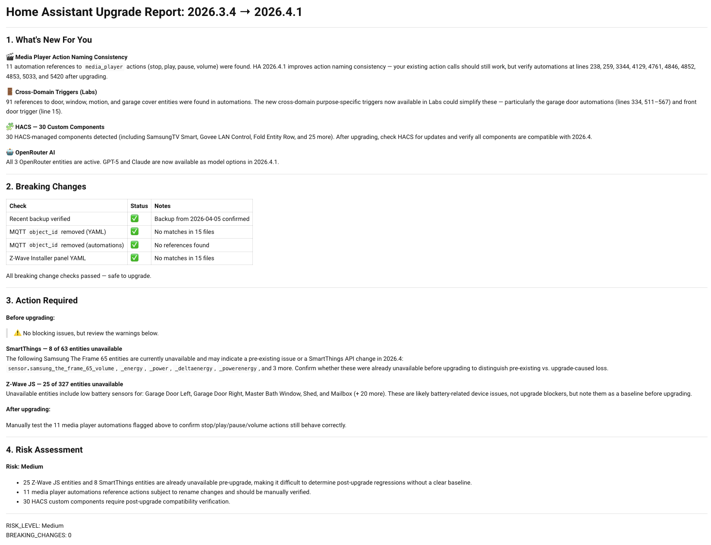

# Upgrade Advisor

[](https://github.com/brianegge/ha-upgrade-advisor/actions/workflows/validate.yml)
[](https://github.com/brianegge/ha-upgrade-advisor/actions/workflows/tests.yml)

AI-powered upgrade analysis for Home Assistant. When an update is available, the integration fetches the release notes, asks your AI agent to identify what could break, then **automatically verifies each potential issue** against your actual configuration — searching your YAML files, checking entity availability, and auditing automations. The result is a report that tells you what IS affected, not what MIGHT be.



## Features

- **Two-phase analysis** — AI identifies potential issues, then the integration verifies them automatically
- Searches your YAML config for deprecated options (secrets files and `.storage` are never read)
- Checks entity availability and automation references
- Analyzes HA core and HACS component updates
- Uses any HA conversation agent (OpenAI, Google, Anthropic, Ollama, etc. via OpenRouter)
- Creates repair issues for verified breaking changes
- Risk assessment (Low/Medium/High) based on evidence, not speculation

## Requirements

- Home Assistant 2024.7.0 or newer
- A configured AI conversation agent (e.g., via OpenRouter, OpenAI, Google Generative AI)

### Choosing an AI agent

Any Home Assistant conversation agent works; this integration doesn't call an AI service itself. Set one up under **Settings > Devices & services** first, then pick it during setup.

Each update costs **two AI requests**: one to plan the checks and one to summarize the results (plus one more if the planning step fails). Updates are analyzed one at a time, but when HACS surfaces several updates at once, that is still several requests within a minute or two.

- **Paid APIs** (OpenAI, Anthropic, Google, OpenRouter credits) — the most reliable choice. Cost depends on the model: HACS updates are small, while a Home Assistant core release sends the full release notes and blog post.
- **Free tiers** — work, within their limits. Google Gemini's free tier allows only a few requests per minute and per day, so a batch of updates can hit HTTP 429 (rate limit) errors; the report then says so for each affected update, and you can re-run the analysis later. [OpenRouter's free models](https://openrouter.ai/collections/free-models) are another free option; which models are free changes over time.
- **Local models** (Ollama) — free and private, with no rate limits. Report quality depends on the model; small models may not follow the structured output the integration needs.

## Installation

### HACS

1. Open HACS in your Home Assistant instance
2. Click the three dots menu and select "Custom repositories"
3. Add `https://github.com/brianegge/ha-upgrade-advisor` as an Integration
4. Click "Download" on the Upgrade Advisor card
5. Restart Home Assistant

### Manual

1. Copy `custom_components/upgrade_advisor/` to your `config/custom_components/` directory
2. Restart Home Assistant

## Setup

### 1. Add the Integration

1. Go to **Settings > Devices & Services > Add Integration**
2. Search for "Upgrade Advisor"
3. Select your AI conversation agent from the dropdown

### 2. Create the Dashboard

Create a dashboard to view the full upgrade report:

1. Go to **Settings > Dashboards > Add Dashboard**
2. Set the title to **Upgrade Advisor**
3. Set the URL to `upgrade-advisor`
4. Enable **Show in sidebar** (optional)
5. Open the new dashboard and add a **Markdown** card:

```yaml
type: markdown
content: >-
  {{ state_attr('sensor.upgrade_advisor_status', 'report') }}
```

Notifications will automatically link to this dashboard. The default path is `upgrade-advisor` and can be changed in the integration options.

### 3. Configure Options (Optional)

Go to **Settings > Integrations > Upgrade Advisor > Configure**:

| Option | Default | Description |
|--------|---------|-------------|
| Conversation agent | (from setup) | The AI agent used for analysis — change it here any time |
| Analyze on update available | On | Auto-analyze when updates appear |
| Analyze HACS updates | On | Include HACS component updates |
| Create repair issues | On | Create repairs for breaking changes |
| Include automations | On | Send automation list to AI for context |
| Include add-ons | On | Send add-on list to AI for context |
| Dashboard URL path | `upgrade-advisor` | Path to the report dashboard |

## How It Works

### Phase 1: AI Plans Checks
When an update is available, the integration fetches release notes from GitHub (including the full blog post for major releases) and sends them to your AI agent along with your installation context. The AI outputs a structured list of automated checks to perform.

### Phase 2: Integration Verifies
The integration executes each check against your actual HA instance:

| Check | What it does |
|-------|-------------|
| `grep_config` | Searches YAML config files for deprecated config keys |
| `entity_available` | Verifies entities for an integration are not unavailable |
| `automation_references` | Finds automations using deprecated services or entities |
| `integration_installed` | Confirms whether an affected integration is present |
| `backup_recent` | Verifies a recent backup exists before upgrading |
| `unavailable_entities` | Baselines currently broken entities (pre-existing issues) |

### Phase 3: AI Summarizes
The check results (with evidence) are sent back to the AI to produce a concise, factual report:

```
## Breaking Changes Verified

| Check                       | Status         | Evidence                              |
|-----------------------------|----------------|---------------------------------------|
| MQTT object_id removal      | Not affected   | Searched 10 YAML files, no matches    |
| Z-Wave Installer panel      | Not affected   | No installer panel config found       |

## Action Required
No action required — safe to upgrade.
```

## What Is Sent to Your AI Agent

Your configuration is read locally by Home Assistant; nothing needs to be on GitHub, and your YAML files are never sent wholesale. For each update, your AI agent receives:

- The release notes (fetched from GitHub's public API)
- Your integrations: each integration's domain and the title of each configured entry
- Your HACS components and their installed versions
- Your automations' names and on/off state — unless **Include automations** is turned off
- In the summary step, the results of the checks it planned, including any matching config lines, with values redacted as described below

The **Include add-ons** option currently sends nothing: reading the add-on list from the Supervisor is not implemented yet.

All of this goes to whichever service runs your conversation agent. To keep it on your own hardware, use a local model.

## Security

Release notes are third-party text and are treated as untrusted input end to end:

- **Secrets are never read.** `grep_config` and `automation_references` skip the entire `.storage` tree and any file whose name suggests credentials — `secrets*`, `credentials*`, `tokens*`, `passwords*`, `*key*`, and `known_devices*`. Only YAML config files are searched.
- **AI-supplied patterns are validated.** Search regexes from the planning phase are rejected if they exceed 200 characters, contain nested quantifiers (catastrophic-backtracking / ReDoS shapes), combine multiple credential keywords (e.g. `password|token|api_key`), or contain no literal text at all (`.`, `.*`, `\S+` — patterns broad enough to harvest the config wholesale). A rejected pattern skips the check — it never runs.
- **Hard execution timeout.** Every pattern search runs through the [`regex`](https://pypi.org/project/regex/) package with a 0.25 s timeout, so a catastrophic-backtracking pattern that slips past the static heuristic aborts the check instead of hanging the executor.
- **Matched values are redacted by default.** Before any matched line is included in a report or sent to your AI agent, its value is replaced with `<redacted>` unless the value is recognizably harmless — a YAML keyword, a number, a template, a `!secret` reference, or a short identifier. Redaction is therefore not limited to keys named `password`/`token`/`api_key`: values like `encryption_key: "abc123=="`, `noise_psk: …`, and `passphrase: …` are masked too. The report keeps the config *shape* it needs to classify a bug, never the value.
- **Report output is sanitized.** The report is written by the AI and rendered as markdown in your dashboard, so it is treated as untrusted output: images are removed, links and bare URLs survive only if they point at `github.com` or `home-assistant.io`, and raw HTML is stripped. This prevents a crafted release note from turning the report into an outbound request from your browser. Model-authored check titles and messages are flattened the same way before being fed back into the summary prompt.
- **Bounded execution.** Lines are capped at 1000 characters before matching and results are capped at 50 matches per check.

## Entities

| Entity | Type | Description |
|--------|------|-------------|
| `sensor.upgrade_advisor_status` | Sensor | Status: `idle` / `analyzing` / `report_ready` / `error` |
| `sensor.upgrade_advisor_risk_level` | Sensor | Risk level: `unknown` / `low` / `medium` / `high` |
| `event.upgrade_advisor_report` | Event | Fires when a new report is generated |

### Status Sensor Attributes

- `current_version` — installed version
- `available_version` — target version
- `last_analysis` — timestamp of last report
- `breaking_change_count` — number of verified breaking changes
- `report` — full report (markdown), including all analyzed components

## Services

| Service | Description |
|---------|-------------|
| `upgrade_advisor.analyze` | Analyze all pending updates (HA core + HACS) |
| `upgrade_advisor.analyze_version` | Analyze a specific HA version |

## Automation Example

```yaml
automation:
  - alias: "Notify on upgrade report"
    trigger:
      - platform: state
        entity_id: sensor.upgrade_advisor_status
        to: "report_ready"
    action:
      - service: notify.mobile_app
        data:
          title: "Upgrade Advisor Report"
          message: >-
            Risk: {{ states('sensor.upgrade_advisor_risk_level') }}
            Breaking changes: {{ state_attr('sensor.upgrade_advisor_status', 'breaking_change_count') }}
            /upgrade-advisor
```

## Known Limitations

- Advisory only — does not perform upgrades
- Analysis quality depends on the AI conversation agent used
- Release notes come from GitHub's public API, which allows 60 unauthenticated requests per hour. Each update needs one or two requests, so this only matters if you analyze dozens of updates within an hour. It does not limit your AI agent.
- Two LLM calls per HA core analysis (plan + summarize) — may take 1-2 minutes
- HACS component detection relies on `release_url` attribute containing a GitHub URL
